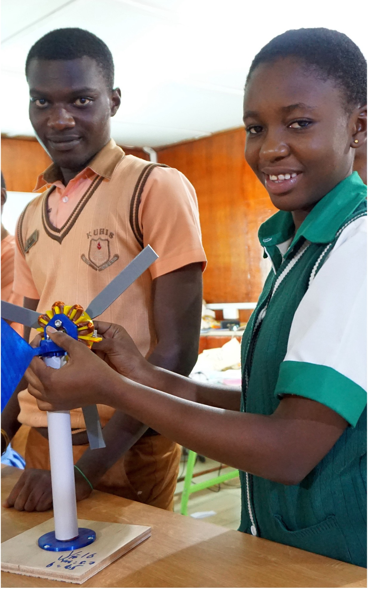
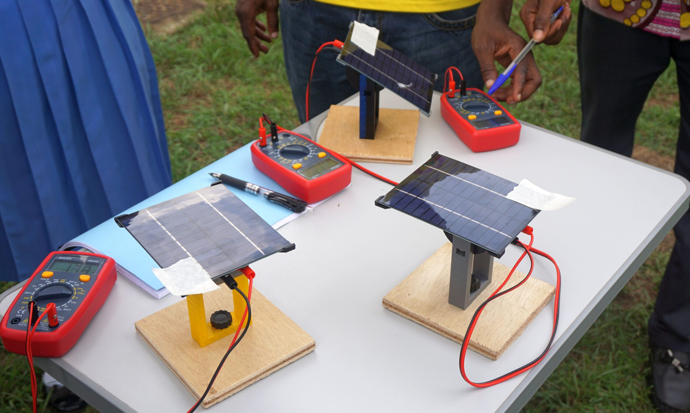
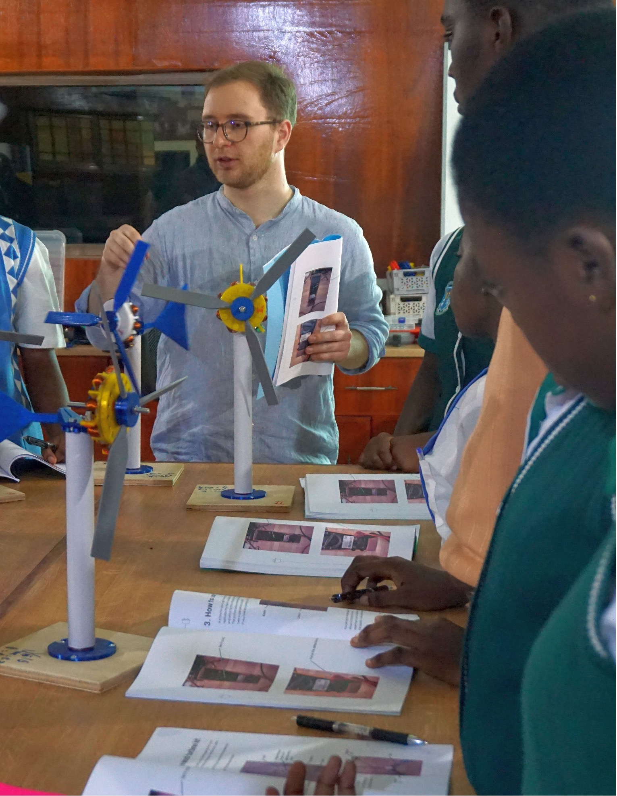
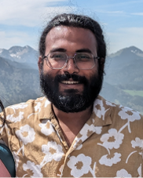
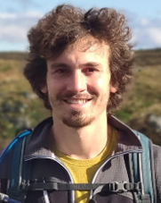
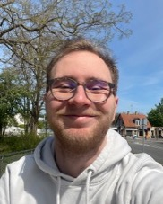
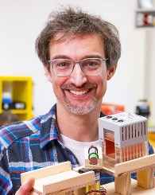
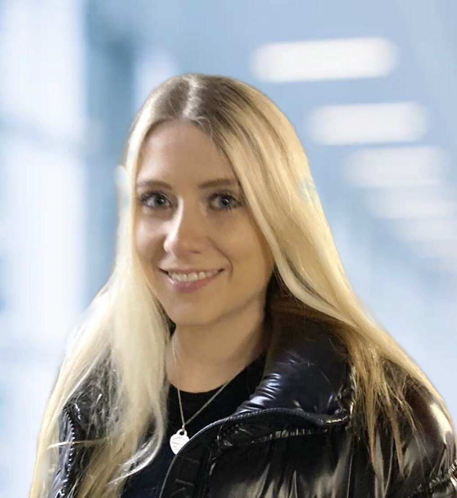
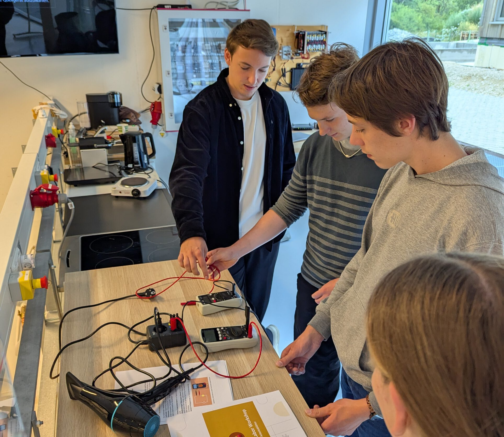

# About Us

# Education is a right, not a privilege.

We are a nonprofit initiative providing hands-on educational kits focused on renewable energy and sustainability.  
Our goal is to make energy literacy accessible, engaging and practical.

## What is EduGrid

## Renewable Energy Eduaction

- Photovoltaics, Wind Energy, Hydro Energy, Grids and Storages
for age 14-18

## Open Sourced, DIY Spirit

- Self developed for most parts
- Encourage users to become developers

## High Quality Textbooks

- Teacher´s and Student´s handbooks
- Online and offline content
- Active learning paradigm through interactions

## 3D-printed Experiment Kits

- Cheap and reproducible anywhere
- Promotes personalization and unique adaptions

## Designed at TU Munich

- Backed by years of experience in scientific communication and teaching students
- Guaranteed quality of product

[Learn More](/teaching-kits/) 

## What we do

## Our Mission

- Develop easy-to-use curriculums – including lesson plans, handbooks, DIY kits, and video guides
- Combine theory with real-world practice to make learning meaningful
- Enable independent learning – no teacher required
- Offer free materials in multiple languages for global accessibility

### Why It Matters

Science education is weakest where teachers are lacking — and Renewable Energy is often missing entirely.  
  
Without access to quality content, students in under-resourced areas miss out on opportunities that shape their future.

[Learn More](/teaching-kits/) 

## Motivation

### Sustainable Change

A well-designed syllabus outlasts great teachers. In developing countries, access to both is scarce. Science education suffers most— Renewable Energy even more. Without structured, scalable learning, the gap grows. We must break this cycle.

[Learn More](/teaching-kits/) 

## Our Journey

### CONCEPTS ’17-22

Multiple camps in Zimbabwe, India and Nepal with rudimentary ideas. Extreme variety in schools.

### DESIGNED ’23-24

Structured syllabus, lesson planning. Textbook creation through TUM students

### IMPLEMENTED ‘25

1-week intensive Renewable Energy Camp for 12 highschoolers in Kumasi, Ghana. New kit Including lesson planning resources for teachers.

[Learn More](/teaching-kits/)

## Meet the Team

### Anurag Mohapatra​

Postdoc TUM, Smart Grids

### Michael Erhardt

PhD TUM, Smart Grids

### Maximilian Hock

PhD TUM, ML for Smart Grids

### Stephan Baur

PhD TUM, Renewable Energy

### Nina Steger

Master´s Student, Sustainable Energies

## Get in touch

Interested in supporting our mission or partnering with us? Help us bring renewable energy education to more classrooms through collaboration or sponsorship.

[Contact us](/contact/) 
