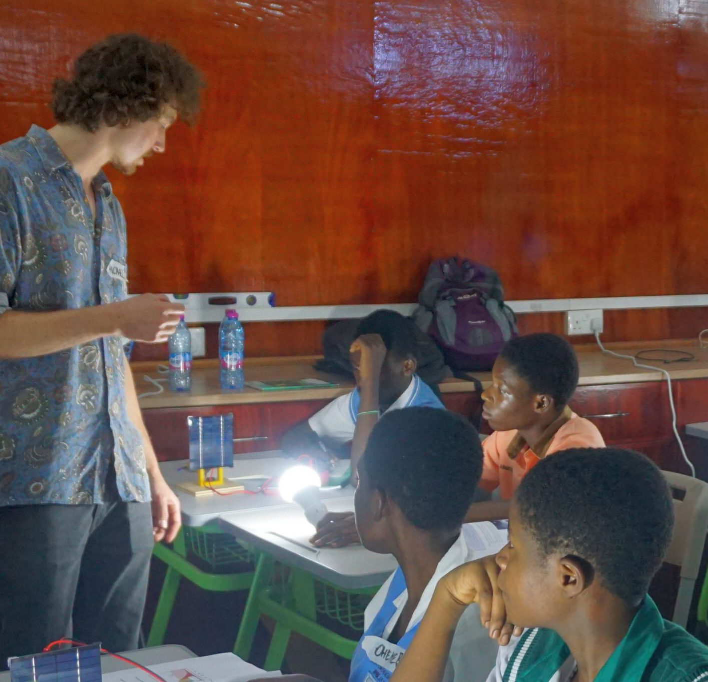

# Teacher Resources

## Welcome, Teachers!

This page is your go-to resource for preparing and delivering **engaging, hands-on lessons** about **renewable energy**. Our carefully designed teaching kits help you bring complex topics to life — with experiments, visuals, and interactive content.

### **Teaching Kits**

🔆 **Solar Energy Kit**  
Introduce students to solar cells, photovoltaic systems, and real-world solar tech. 🌊 **Hydro Energy Kit**  
Explore the power of water, turbine mechanics, and the natural water cycle. 🌬️ **Wind Energy Kit**  
Teach how wind creates motion and energy through turbines and blades. 

## What’s Inside Each Kit

Whether you're introducing solar panels, hydropower, or wind turbines, each Teaching Kit provides everything needed for a full, engaging lesson.

✅ **Assembly Instructions**  
Clear step-by-step guide with material list 🎓 **Teacher Presentation**  
Ready-to-use slides for your lesson delivery 📝 **Student Worksheet**  
Experiments, questions, and writing space 👩‍🏫 **Teacher Worksheet**  
Guidance, background info, and answers

## Educational Note

These kits are designed to be **hands-on** and accessible — no prior knowledge of electrical engineering needed.

They also offer **advanced learning** for experienced students: data analysis in Excel, efficiency calculations, and critical discussions on energy policy in Ghana and Germany.

Perfect for STEM weeks, science class, or **Education for Sustainable Development**.

## Try it. Test it. Understand it.

Our Kits

### Wind

Build your own turbine and explore lift, drag, and optimal blade design.  
  

[Learn More](/teacher-wind-landing/)

### Hydro

Generate power from falling water and investigate efficiency with your own mini dam.

[Learn More](/teacher-hydro-landing/)

### Solar

Discover how sunlight turns into electricity. Experiment with angles, shading, and voltage.

[Learn More](/teacher-solar-worksheet/)

### Storage

Coming soon...  

### Battery

Coming soon....
