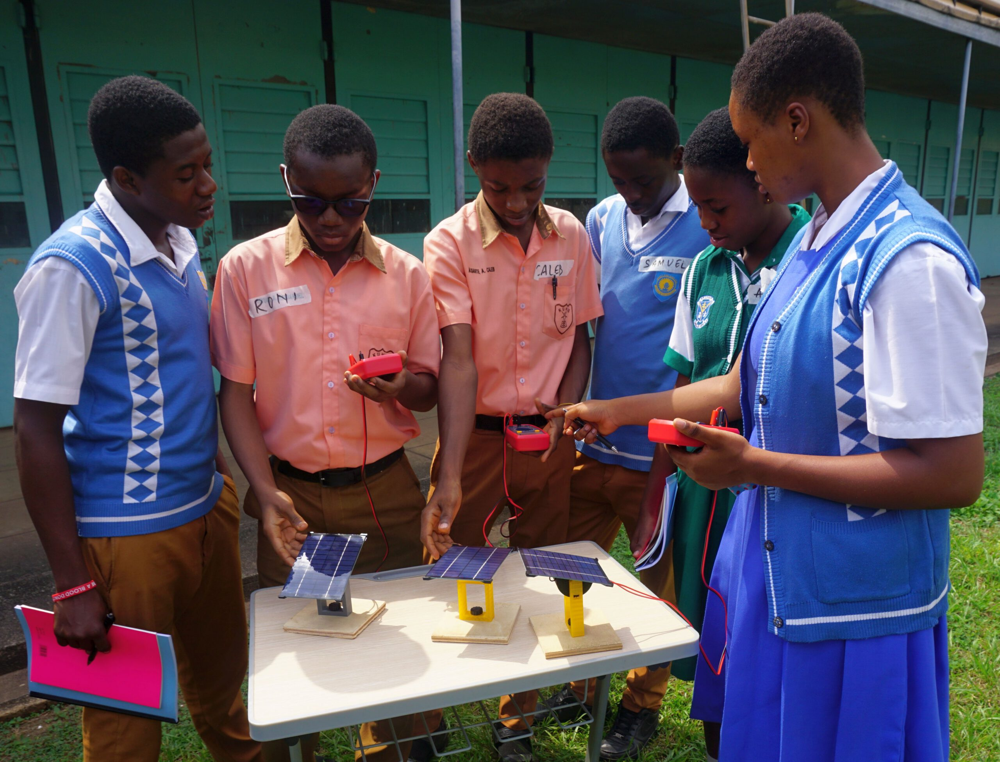
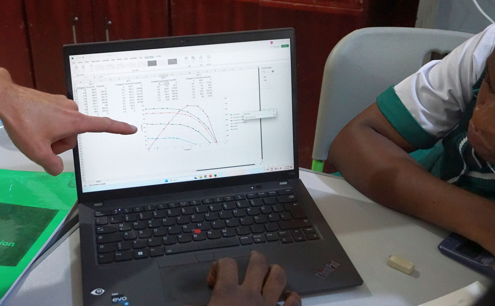

# Education is a right, not a privilege

Open-source, 3D-printable kits and textbooks from TU Munich that turn every classroom into a hands-on photovoltaic, wind, hydro, grid and storage energy lab, empowering students to become renewable-power innovators.

[Explore Our Kits](/teaching-kits/)  

## We equip every student to explore, question and shape the energy systems of the future - wherever they are.

**The Challenge**

A well-designed syllabus can outlive the greatest teacher, but in many classrooms, students have access to neither. Science education suffers and renewable-energy lessons are the first to vanish. Without structured, scalable learning, the gap widens just as the climate crisis demands an informed generation.

**Our Solution**

We democratise hands-on renewable-energy education by combining open-source curricula with DIY experiment kits to have real impact in the education.

[More About Us](/about/)

#### Try it. Test it. Understand it.

Our Kits

### Wind

Build your own turbine and explore lift, drag, and optimal blade design.  

[Students](/student-wind-landing/) [Teachers](/teacher-wind-landing/)

### Hydro

Generate power from falling water and investigate efficiency with your own mini dam.

[Students](/student-hydro-landing/) [Teachers](/teacher-hydro-landing/)

### Solar

Discover how sunlight turns into electricity. Experiment with angles, shading, and voltage.

[Students](/elementor-166/) [Teachers](/teacher-solar-worksheet/)

### Storage

Coming soon...

### Battery

Coming soon...

### Access Teaching Kit Resources

[→ For Teachers](/for-teachers/) [→ For Students](http://edugrid20.local/for-students/)

## Stories from classrooms, workshops & beyond

Explore what happens when kits meet real students – from German schools to communities in Ghana.

[Our Blog](/services/) 
