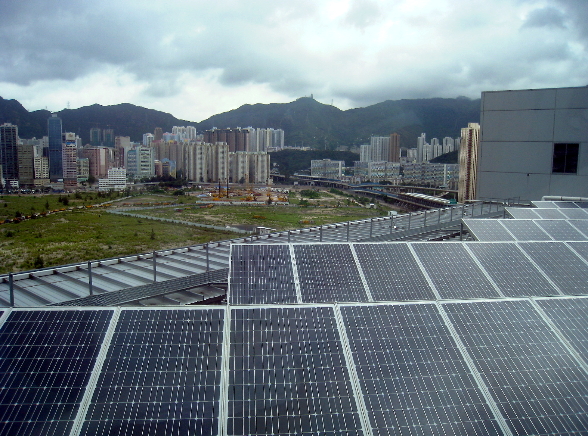

# Teaching Kits

## 

Where curiosity meets creation – bringing renewable energy to life through hands-on learning.

## Welcome to our Teaching Kits!

Our **Renewable Energy Teaching Kits** are designed to bring sustainability into the classroom through hands-on learning. These kits help students understand the principles of clean energy while giving teachers the tools to teach with confidence and creativity.  
  
Each kit focuses on one key topic in the world of **renewable energy** and comes with everything you need for practical learning: **teacher instructions** , **student worksheets**, and a **classroom presentation** to support every lesson.

### 💧 Hydro Kit

Harness the power of flowing water to generate clean energy.

#### Hydro Teaching Kit

What’s inside

This kit demonstrates how water flow turns turbines to produce electricity. It’s a fun, powerful way to teach renewable energy.

[Students](/student-hydro-landing/) [Teachers](/teacher-hydro-landing/)

### 🌀 Wind Kit

Explore how wind turbines convert air movement into electricity.

#### Wind Teaching Kit

What’s inside

Learn about turbine mechanics, blade design, and how wind power is harnessed efficiently in real-world systems.

[Students](/student-wind-landing/) [Teachers](/teacher-wind-landing/)

### 🔆 Solar Kit

Discover how sunlight becomes electricity using photovoltaic cells.

#### Solar Teaching Kit

What’s inside

This kit helps students understand solar energy by building small-scale photovoltaic systems for hands-on learning.

[Students](/elementor-166/) [Teachers](/teacher-solar-worksheet/)

### ⚡ Storage Kit

Coming soon: Learn about energy storage and real-world use.

### 🔋 Battery Kit

Coming soon: Explore battery tech and storage principles.
